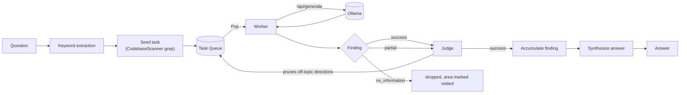
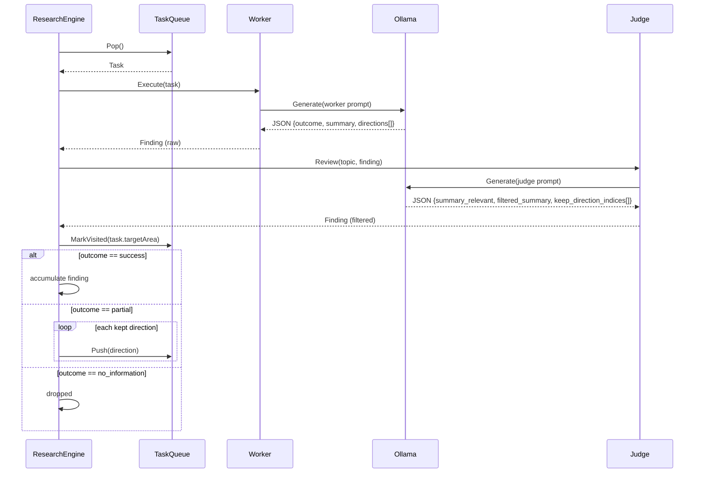
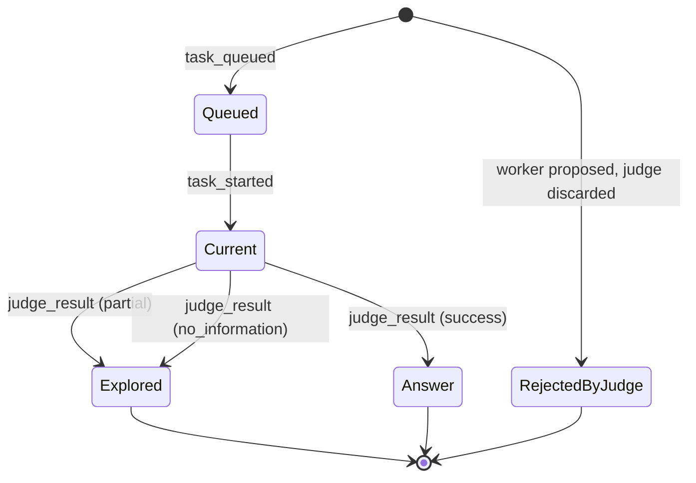
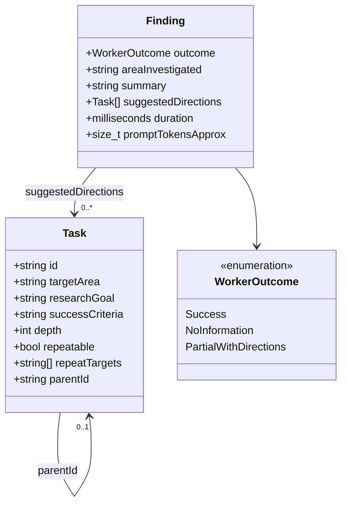
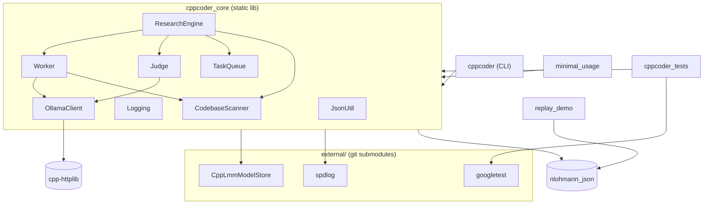

# CppCoder

A C++23 sustained-research engine for answering questions about a large
codebase with a small local LLM. It implements the worker/judge/task-queue
architecture described in *"Building a Code Assistant, Part 2: A
Sustained Research Engine"*: rather than dumping the whole repository
into a single context window, the question is broken into a sequence of
bounded research tasks that a local model (via [Ollama](https://ollama.com))
works through one at a time, with a second model pass acting as a judge
that prunes anything off-topic before it re-enters the queue.

A question is answered incrementally:

1. **Keyword extraction** pulls identifier-like terms out of the question.
2. Those keywords **seed an initial task** by grepping the codebase for
   candidate files.
3. A **worker** investigates one area at a time, bounded to a token
   budget (~120K by default, matching the empirical usable context
   window of small local models), and reports one of three outcomes.
4. A **judge** reviews the worker's findings and follow-up directions,
   discarding anything unrelated to the original question.
5. Surviving directions **re-enter the queue**; areas are never
   revisited. The loop continues until the queue drains, an iteration
   cap is hit, or a wall-clock budget (default 90 minutes) runs out.
6. Once at least one task succeeds, the accumulated findings are
   **synthesized into a final answer**.

## Architecture



### One loop iteration



### Task / Finding lifecycle

Mirrors the states shown in the web UI (`web/index.html`):



### Core types



### Module / build-target graph



## Repository layout

```
CppCoder/
├── include/cppcoder/     Public headers (Task, Finding, Worker, Judge, ...)
├── src/                  Implementation + main.cpp (CLI entry point)
├── tests/                88 GoogleTest cases
├── examples/             replay_demo, minimal_usage, demo_events.jsonl
├── web/                  index.html -- live task-graph visualizer
└── external/             git submodules: CppLmmModelStore, spdlog, googletest
```

## Build

```
cmake -B build -S .
cmake --build build -j$(nproc)
```

Requires `nlohmann-json3-dev` (`apt install nlohmann-json3-dev`); cpp-httplib
is fetched via CMake FetchContent. `external/CppLmmModelStore`,
`external/googletest`, and `external/spdlog` are git submodules:

```
git submodule update --init --recursive
```

| Submodule | Purpose |
|---|---|
| `external/CppLmmModelStore` | Shared local-model path resolution (zero-duplication convention used across this author's other projects) |
| `external/spdlog` | All runtime logging |
| `external/googletest` | Test suite |

## Run

```
ollama pull qwen2.5-coder:7b
./build/src/cppcoder --question "How does X work?" --codebase /path/to/repo
```

| Option | Default | Description |
|---|---|---|
| `--question <text>` | *(required)* | Question to research |
| `--codebase <path>` | *(required)* | Root of the codebase to investigate |
| `--model <name>` | `qwen2.5-coder:7b` | Ollama model tag |
| `--host <host>` | `localhost` | Ollama host |
| `--port <port>` | `11434` | Ollama port |
| `--max-minutes <n>` | `90` | Wall-clock budget |
| `--max-iterations <n>` | `200` | Max task-loop iterations |
| `--token-budget <n>` | `120000` | Approx tokens per task |
| `--events-file <path>` | *(none)* | Write JSON-Lines engine events (consumed by `web/index.html` and `examples/replay_demo`) |
| `--log-level <level>` | `info` | `trace\|debug\|info\|warn\|err\|critical\|off` |
| `--log-file <path>` | *(none)* | Also write logs to this file |

## Logging

All runtime logging goes through [spdlog](https://github.com/gabime/spdlog)
(colored console sink + optional file sink), not raw `std::cerr`:

```
./build/src/cppcoder --question "..." --codebase . --log-level debug --log-file /tmp/run.log
```

CLI usage/argument errors and the final answer report still go to plain
stderr/stdout, since those are the tool's actual output rather than
diagnostic logging.

## Test

88 tests across JSON extraction, task-queue dedup/visited logic,
codebase scanning, and the worker/judge parsing logic. The network-facing
parts are tested via pure functions -- `Worker::ParseWorkerResponse`,
`Judge::ApplyJudgeResponse`, `FallbackKeywords`, `ResearchEngine::SeedInitialTasks`
-- so none of it needs a running Ollama instance:

```
cd build && ctest --output-on-failure
```

| Test file | Cases | Covers |
|---|---|---|
| `JsonUtilTests.cpp` | 15 | Brace/bracket extraction from model output |
| `TypesTests.cpp` | 8 | `Task` defaults, `EstimateTokens` |
| `TaskQueueTests.cpp` | 13 | Dedup, visited tracking, FIFO order, repeatable tasks |
| `CodebaseScannerTests.cpp` | 14 | Recursive scan, token budgeting, `.git`/`build` exclusion, keyword search |
| `WorkerTests.cpp` | 13 | Worker JSON response parsing, malformed/prose-wrapped input |
| `JudgeTests.cpp` | 12 | Direction pruning, summary filtering, outcome downgrade |
| `ResearchEngineTests.cpp` | 11 | Keyword fallback, seed-task construction |

## Examples

`examples/` builds two small executables:

- **`replay_demo`** replays a JSON-Lines event log (the same schema
  `--events-file` writes, and the same schema `web/index.html` consumes)
  directly in the terminal, either one event at a time or auto-played at
  any speed:

  ```
  ./build/examples/replay_demo --events examples/demo_events.jsonl --step
  ./build/examples/replay_demo --events examples/demo_events.jsonl --speed 4
  ./build/examples/replay_demo --events /tmp/real_run.jsonl --speed 0.5
  ```

  `examples/demo_events.jsonl` is a recorded example run (the PDF
  encryption-key scenario) so this works with no engine or Ollama
  instance required.

- **`minimal_usage`** exercises the library's network-free pieces
  directly (`FallbackKeywords`, `CodebaseScanner`, `TaskQueue`) as a
  getting-started reference:

  ```
  ./build/examples/minimal_usage /path/to/repo
  ```

## Web UI

`web/index.html` is a self-contained, dependency-free page that
visualizes a research run as a task graph (question → keyword probe →
worker/judge chain → answer), matching the architecture above.

Open it directly in a browser:

- **Play demo** replays a scripted example run with no engine required.
- **Load events file** reads the JSON-Lines output of a real run:

  ```
  ./build/src/cppcoder --question "..." --codebase /path/to/repo \
      --events-file /tmp/run.jsonl
  ```

  then load `/tmp/run.jsonl` in the page. Nodes animate through queued →
  current → explored/answer states as the file replays; directions the
  judge discarded appear as red-X stubs off the task that proposed them.

## License

MIT. See [LICENSE](LICENSE).
