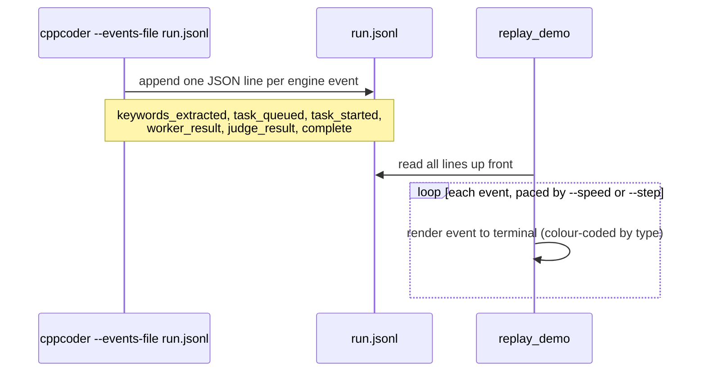

# examples/

Two small standalone executables plus a recorded sample run. Neither
needs a running Ollama instance.

| File | Builds | Needs |
|---|---|---|
| `replay_demo.cpp` | `replay_demo` | `nlohmann_json`, `Threads` only -- not even `cppcoder_core` |
| `minimal_usage.cpp` | `minimal_usage` | `cppcoder_core` |
| `demo_events.jsonl` | *(data, not code)* | a recorded example run (the PDF encryption-key scenario) |

## `replay_demo`

Replays a JSON-Lines event log -- the same schema `cppcoder --events-file`
writes and `web/index.html` consumes -- directly in the terminal with
ANSI colour, either one event at a time or auto-played at a chosen
speed.

```
./build/examples/replay_demo --events examples/demo_events.jsonl --step
./build/examples/replay_demo --events examples/demo_events.jsonl --speed 4
./build/examples/replay_demo --events /tmp/real_run.jsonl --speed 0.5
./build/examples/replay_demo --events examples/demo_events.jsonl --no-color
```

| Option | Default | Description |
|---|---|---|
| `--events <path>` | *(required)* | JSON-Lines event log to replay |
| `--step` | *(off)* | Wait for Enter between events instead of auto-playing |
| `--speed <n>` | `1.0` | Playback speed multiplier (`2.0` = twice as fast); ignored with `--step` |
| `--no-color` | *(off)* | Disable ANSI colour output |

Because it only depends on `nlohmann_json` (not `cppcoder_core`), this
is a good template if you want to build a *different* consumer of the
event schema -- e.g. a TUI, a log shipper, anything that just needs to
read `ResearchEngine`'s `EventSink` output without linking the research
engine itself.



## `minimal_usage`

Exercises the library's network-free pieces directly as a
getting-started reference and a link-time smoke test:

```
./build/examples/minimal_usage [path-to-scan]   # defaults to "."
```

Runs, in order: `FallbackKeywords` against a sample question,
`CodebaseScanner::FindFilesMatchingKeyword` against the given path, and
a `TaskQueue` walkthrough showing area-dedup rejecting a duplicate push
and a re-push of an already-visited area. Good first place to look if
you're linking `cppcoder_core` from a new project and want to confirm
the include paths/link libraries are set up correctly before writing
real code against it.
