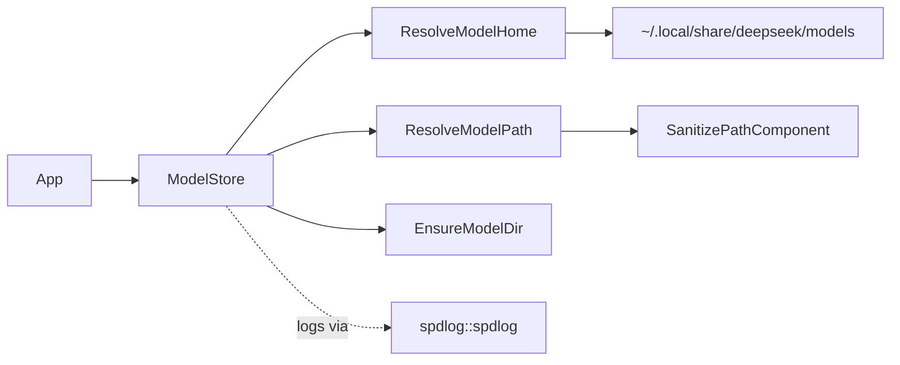

# ModelStore

Reusable model‑path and streaming utilities for DeepSeek projects. This folder is structured to be split into its own repository and consumed by multiple applications -- CppCoder is its first consumer, adding it as `external/CppLmmModelStore`.

**Structure**


`SanitizePathComponent` replaces filesystem-hostile characters
(`: * ? " < > | \`) with `_` before any model name is turned into a
path segment. This exists because Windows/NTFS treats a colon inside a
path component as Alternate-Data-Stream syntax, not a literal
character -- so an Ollama-style tag like `qwen2.5-coder:7b` would
silently resolve to the wrong (or no) file without it. Every call goes
through `ResolveModelPath`, so this applies uniformly regardless of
caller. Path resolution, directory creation, and existence checks all
emit `spdlog` debug/info/error lines (see `src/ModelStore.cpp`), so a
consuming app's own log sink shows what `ModelStore` decided and why.

**Build**
```bash
cmake -S . -B build
cmake --build build
```

**Dependency resolution -- spdlog and googletest**

Both `spdlog::spdlog` and `GTest::gtest_main` are resolved the same
way, checked in this order, so building standalone and building as a
submodule of a project that already provides these targets both work
without double-vendoring:

1. `if (NOT TARGET spdlog::spdlog)` / `if (NOT TARGET GTest::gtest_main)` --
   if a parent project (e.g. CppCoder's top-level `CMakeLists.txt`,
   which adds `external/spdlog` and `external/googletest` before this
   submodule) already defined the target, reuse it directly. This is
   the path CppCoder itself takes.
2. `find_package(... CONFIG QUIET)` -- a system/package-manager install.
3. A vendored checkout at `../spdlog` / `../googletest` or
   `../third_party/spdlog` / `../third_party/googletest`.
4. `FetchContent`, only if `-DMODELSTORE_ALLOW_FETCHCONTENT=ON`.
5. Otherwise: `spdlog` missing is a hard `FATAL_ERROR` (the library
   can't build without it); `googletest` missing just disables
   `MODELSTORE_BUILD_TESTS` with a `WARNING` (the library itself still
   builds fine without its tests).

**Tests**
```bash
cmake -S . -B build -DMODELSTORE_ALLOW_FETCHCONTENT=ON
cmake --build build
ctest --test-dir build
```
`ModelStoreTests` (includes a
`SanitizesColonsInModelNameForWindowsCompatibility` case) and
`StreamParserTests` both link `GTest::gtest_main` -- whichever target
resolution step above found or created it, so as a CppCoder submodule
they share the exact same GTest build the rest of `cppcoder_tests`
uses.

**Ensure models via CMake**
```bash
cmake -S . -B build -DDEEPSEEK_MODELS="deepseek-r1;deepseek-v3"
cmake --build build --target ensure_models
```
Note: `ensure_models` runs once per build directory (stamp file). Delete `build/.ensure_models.stamp` to re-run.
To run automatically on every build, configure with `-DMODELSTORE_AUTO_ENSURE_MODELS=ON`.

**Ensure model directories (Python)**
```bash
python3 scripts/ensure_models.py --model deepseek-r1
```

**Install**
```bash
cmake -S . -B build -DBUILD_SHARED_LIBS=ON
cmake --build build
cmake --install build
```

Then in another project:
```cmake
find_package(ModelStore CONFIG REQUIRED)
target_link_libraries(your_target PRIVATE ModelStore::ModelStore)
```

**Environment**
- `DEEPSEEK_MODEL_HOME`: Optional override for the global model store.
- `XDG_DATA_HOME`: Optional base for the default model store.

Default model store:
- `~/.local/share/deepseek/models`

**Windows notes**
- `getenv` calls are wrapped in `#pragma warning(push)` / `disable :
  4996` / `pop` (MSVC-only) rather than a blanket suppression, so the
  deprecation warning is silenced only where it's actually expected.
- Tests use portable `SetEnvVar`/`UnsetEnvVar` helpers (`_putenv_s` on
  `_WIN32`, `setenv`/`unsetenv` elsewhere) instead of calling the POSIX
  functions directly, since MSVC's CRT doesn't provide `setenv`/`unsetenv`
  at all.
