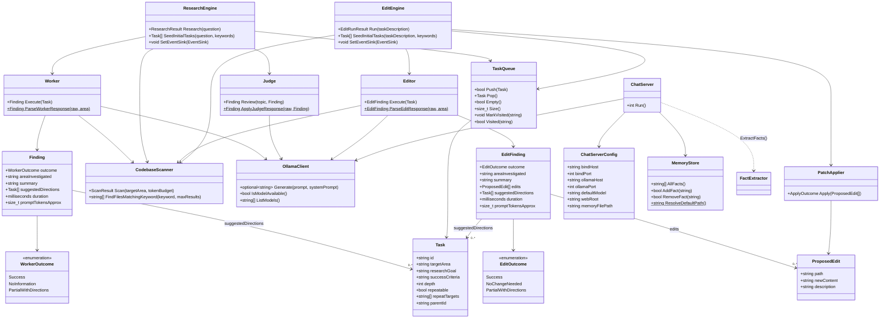

# include/cppcoder/

Public headers for the `cppcoder_core` library. Everything here is
namespaced under `cppcoder` (except `deepseek::ModelStore`, which lives
in the `external/CppLmmModelStore` submodule and is included directly as
`<ModelStore.hpp>`).

Three roughly independent groups of headers live here: the **research
engine** (question in, answer out, no HTTP server involved), the **edit
engine** (task in, files changed on disk, mirrors the research engine's
shape but writes instead of just reading), and the **chat server** (a
small local web app on top of the same `OllamaClient`). `main.cpp` is
the only thing that wires all three to a CLI flag (`--question` vs
`--task` vs `--serve`).

## Research engine headers

| Header | Purpose |
|---|---|
| `Types.h` | `Task`, `Finding`, `WorkerOutcome`, `EditFinding`, `EditOutcome`, `ProposedEdit`, `EventSink`, `EstimateTokens()` -- the shared vocabulary every other research- and edit-engine header builds on. |
| `TaskQueue.h` | FIFO queue with area-dedup: rejects a `Task` if its `targetArea` is already queued or already visited. Shared by `ResearchEngine` and `EditEngine`. |
| `CodebaseScanner.h` | Reads source files under a root/target area within a token budget; also does a cheap keyword grep used to seed initial tasks. Shared by `ResearchEngine` and `EditEngine`. |
| `OllamaClient.h` | Thin synchronous wrapper around Ollama's `/api/generate` (used by `Worker`/`Judge`/`Editor`) and `/api/tags` (`IsModelAvailable`, `ListModels`). |
| `Worker.h` | Executes one `Task`: gathers context via `CodebaseScanner`, calls the model, parses the response into a `Finding`. `ParseWorkerResponse` is pure/static and unit-testable without Ollama running. |
| `Judge.h` | Reviews a `Worker`'s `Finding` against the original question and prunes off-topic content/directions. `ApplyJudgeResponse` is pure/static, same testability story as `Worker`. |
| `ResearchEngine.h` | Orchestrates the whole research loop: keyword extraction → seed task → worker/judge loop → answer synthesis. Owns the `EventSink` used to emit JSON-Lines events for `web/index.html`. |
| `JsonUtil.h` | `ExtractJsonObject`/`ExtractJsonArray` -- pull the outermost `{...}`/`[...]` span out of model output that's wrapped in prose or markdown fences. Reused as-is by edit mode's parsing. |
| `Logging.h` | `InitLogging()` -- configures the default spdlog logger (console + optional file sink) used everywhere in this library. |

## Edit engine headers

| Header | Purpose |
|---|---|
| `Editor.h` | Executes one `Task` as a change instead of a research question: gathers context via `CodebaseScanner` (reused as-is), calls the model, parses the response into an `EditFinding` containing full-replacement `ProposedEdit`s. `ParseEditResponse` is pure/static, same testability story as `Worker::ParseWorkerResponse`. |
| `PatchApplier.h` | Writes `ProposedEdit`s to disk under a fixed root, rejecting any edit whose resolved path would escape that root. The only thing in this codebase that writes arbitrary source files. |
| `EditEngine.h` | Orchestrates the edit loop: same keyword-seeded task queue as `ResearchEngine`, but drives `Editor` (no judge step) and either accumulates proposed edits (dry-run, default) or applies them via `PatchApplier` immediately as they're produced (`--apply`). Shares the `EventSink` mechanism with `ResearchEngine`. |

## Chat server headers

| Header | Purpose |
|---|---|
| `ChatServer.h` | Local HTTP server (cpp-httplib) serving `web/chat.html` and proxying `/api/chat` straight through to Ollama, streaming NDJSON back. Owns a `MemoryStore`. |
| `MemoryStore.h` | Thread-safe persisted fact list (`~/.models/memory.json` by default) with case-insensitive dedup on add. |
| `FactExtractor.h` | `ExtractFacts(message)` -- regex heuristics that pull durable facts ("my name is...", "I am NN yo") out of a single chat message. |

## Class diagram

## Conventions worth knowing

- **Pure-function testability.** `Worker::ParseWorkerResponse`,
  `Judge::ApplyJudgeResponse`, `Editor::ParseEditResponse`,
  `ResearchEngine::FallbackKeywords`/`SeedInitialTasks`,
  `EditEngine::SeedInitialTasks` are all `static` or free functions with
  no I/O, specifically so `tests/` can exercise the model-response-parsing
  logic without a running Ollama instance. Keep new parsing logic in this
  shape if you add to it. `PatchApplier::Apply` is the one deliberate
  exception in the edit engine -- writing files is its entire job, so its
  tests use a temp-directory fixture instead (see `tests/PatchApplierTests.cpp`).
- **`EventSink`** (`Types.h`) is a `std::function<void(const
  std::string&)>` called once per already-serialized JSON event line,
  shared by `ResearchEngine` and `EditEngine`. `main.cpp` wires it to a
  file when `--events-file` is given; that file is what `web/index.html`
  and `examples/replay_demo` consume. Edit mode emits additional event
  types (`edit_result`, `edit_proposed`, `edit_applied`, `edit_rejected`)
  on the same sink -- `web/index.html`'s event switch no-ops gracefully
  on types it doesn't recognize.
- **Edits are full-file replacements, not diffs.** `ProposedEdit.newContent`
  is the complete new content of the file, not a patch. This trades
  tokens (the model must reproduce the whole file, not just the changed
  lines) for reliability: no diff/patch-matching logic exists in this
  codebase, and a malformed unified-diff hunk from a small local model is
  a much harder failure mode to detect than a full-file write.
- **Header include weight.** `ResearchEngine.h` pulls in every other
  research-engine header; `EditEngine.h` pulls in `Editor.h`/`PatchApplier.h`
  the same way; `ChatServer.h` only needs `MemoryStore.h`. There's no
  header that depends on more than one group except `main.cpp` itself.
