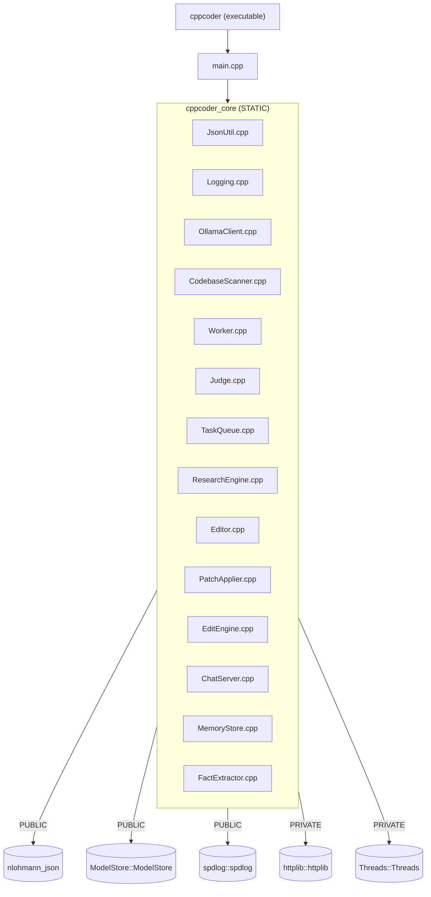

# src/

Implementation of every header in `include/cppcoder/`, plus `main.cpp`
(the single CLI entry point for research mode, edit mode, and chat mode).
Builds into one static library, `cppcoder_core`, linked by the
`cppcoder` executable, `tests/cppcoder_tests`, and `examples/minimal_usage`.

## Files

| File | Implements | Notes |
|---|---|---|
| `JsonUtil.cpp` | `ExtractJsonObject`/`ExtractJsonArray` | Brace/bracket-depth scanning, no JSON parsing involved (the input isn't guaranteed to be valid JSON yet). |
| `Logging.cpp` | `InitLogging` | Maps a level name string to spdlog's enum; sets up console + optional file sink. |
| `CodebaseScanner.cpp` | `CodebaseScanner` | Recursive directory walk, extension filtering, `.git`/`build` exclusion, token-budget-aware truncation. |
| `OllamaClient.cpp` | `OllamaClient` | Synchronous `httplib::Client` calls to `/api/generate` and `/api/tags`. One client per call site; cheap to construct. |
| `Worker.cpp` | `Worker` | Builds the worker prompt, calls `OllamaClient::Generate`, parses the JSON response (`ParseWorkerResponse`) into a `Finding`. |
| `Judge.cpp` | `Judge` | Builds the judge prompt, calls the model, applies the response (`ApplyJudgeResponse`) to prune the `Finding`. |
| `TaskQueue.cpp` | `TaskQueue` | `std::deque` + two `unordered_set`s (queued areas, visited areas) for O(1) dedup checks. |
| `ResearchEngine.cpp` | `ResearchEngine` | The orchestration loop described in the root README; also `FallbackKeywords`. |
| `Editor.cpp` | `Editor` | Same shape as `Worker`, but asks the model for full replacement file content instead of a research summary; parses it into an `EditFinding` (`ParseEditResponse`). |
| `PatchApplier.cpp` | `PatchApplier` | Writes `ProposedEdit`s to disk, rejecting any path that would resolve outside the codebase root (path-traversal / absolute-path guard). |
| `EditEngine.cpp` | `EditEngine` | Edit-mode's orchestration loop: same keyword-seeded task queue as `ResearchEngine`, but drives `Editor` (no judge step) and either accumulates or applies proposed edits. |
| `ChatServer.cpp` | `ChatServer` | httplib **server**: static file serving, `/api/models`, `/api/memory` (GET/POST/DELETE), `/api/chat` (streaming proxy to Ollama). |
| `MemoryStore.cpp` | `MemoryStore` | JSON read/write of the facts file, mutex-guarded, case-insensitive dedup. |
| `FactExtractor.cpp` | `ExtractFacts` | The regex pattern table -- see comments there before adding a new phrasing. |
| `main.cpp` | CLI entry point | Argument parsing, then dispatches to the research loop, the edit loop, or `ChatServer::Run()`. |

## Build targets

`nlohmann_json`/`ModelStore`/`spdlog` are linked `PUBLIC` because
`cppcoder_core` is a **static** library: PRIVATE dependencies of a
static lib don't automatically propagate to whatever finally links it
(a real CMake gotcha), so anything a consumer's final link step needs
has to be PUBLIC here. `httplib` and `Threads` stay `PRIVATE` since
nothing outside `cppcoder_core`'s own `.cpp` files touches them
directly.

## Three entry points, one binary

`main.cpp` parses `argv` once and then takes one of three paths, checked
in this order:

- `--serve`: builds a `ChatServerConfig` (resolving `--web-root` via
  `ResolveDefaultWebRoot()` if not given explicitly) and calls
  `ChatServer::Run()`, which blocks serving HTTP until Ctrl+C.
- `--task` (non-empty): requires `--codebase`, runs
  `EditEngine::Run()`, prints proposed edits (dry-run, the default) or
  the write/reject/error report (`--apply`), exits.
- Otherwise: requires `--question`/`--codebase`, runs
  `ResearchEngine::Research()`, prints the answer, exits.

There's no shared state between the three paths beyond `OllamaConfig`
(host/port/model) -- see `include/cppcoder/README.md` for the header-level
picture, and the root README's [Edit mode](../README.md#edit-mode) and
[Chat mode](../README.md#chat-mode) sections for the request-level detail.
