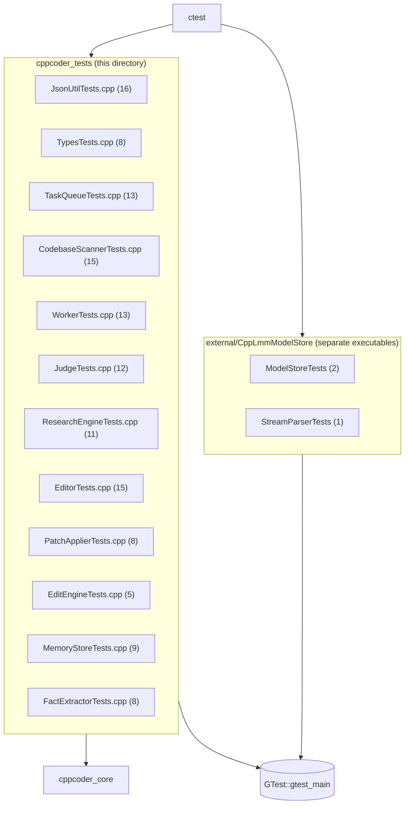

# tests/

133 GoogleTest cases, all offline -- nothing here needs a running Ollama
instance. Everything that would normally require the network is tested
by calling a pure/static parsing function directly with a canned model
response (see `include/cppcoder/README.md`'s "pure-function testability"
note).

```
cd build && ctest --output-on-failure
```

or filter to just this repo's own suite (as opposed to the
`external/CppLmmModelStore` submodule's `ModelStoreTests`/`StreamParserTests`,
which register separately -- see below), excluding them by name since
ctest's `-R`/`-E` use POSIX regex (no lookahead):

```
ctest -E 'ModelStoreTests|StreamParserTests'
```

## Files

| File | Cases | Covers |
|---|---|---|
| `JsonUtilTests.cpp` | 16 | `ExtractJsonObject`/`ExtractJsonArray`: plain, prose-wrapped, markdown-fenced, nested, empty, and malformed input. |
| `TypesTests.cpp` | 8 | `Task` default field values, `EstimateTokens` scaling. |
| `TaskQueueTests.cpp` | 13 | Push/pop order, area dedup (queued + visited), repeatable-task umbrella semantics. |
| `CodebaseScannerTests.cpp` | 15 | Recursive scan, `.git`/`build` exclusion, token-budget truncation, single-file vs. directory target areas, keyword search (case-insensitivity, filename matches, result caps). |
| `WorkerTests.cpp` | 13 | `ParseWorkerResponse`: all three outcomes, malformed/prose-wrapped/empty responses, direction-id generation. |
| `JudgeTests.cpp` | 12 | `ApplyJudgeResponse`: direction pruning by index, summary filtering, outcome downgrade when nothing survives, malformed/truncated judge JSON. |
| `ResearchEngineTests.cpp` | 11 | `FallbackKeywords` (stopwords, casing, short-word filtering) and `SeedInitialTasks` (dedup across keyword matches). |
| `EditorTests.cpp` | 15 | `ParseEditResponse`: all three outcomes, edits/directions parsing, malformed/prose-wrapped/empty responses, path-less edits filtered. |
| `PatchApplierTests.cpp` | 8 | `Apply`: overwrite/create/parent-dir-creation, path-traversal and absolute-path rejection, multi-edit batches, empty input. |
| `EditEngineTests.cpp` | 5 | `SeedInitialTasks` (same dedup/merge expectations as `ResearchEngineTests.cpp`), `EditEngineConfig` dry-run default. |
| `MemoryStoreTests.cpp` | 9 | Persistence round-trip, case-insensitive add-dedup, remove, empty/whitespace rejection, `ResolveDefaultPath` env-var precedence. |
| `FactExtractorTests.cpp` | 8 | Name/age regex patterns (with and without "is"), assistant-name phrasing, multi-fact messages, no-match cases. |

## Test composition



## Adding a test

- New research-engine parsing edge case → extend `WorkerTests.cpp` or
  `JudgeTests.cpp` against `ParseWorkerResponse`/`ApplyJudgeResponse`
  directly; don't spin up `OllamaClient`.
- New edit-mode parsing edge case → extend `EditorTests.cpp` against
  `Editor::ParseEditResponse` directly, same pure-function convention.
  Filesystem-touching edit-mode logic (`PatchApplier::Apply`) uses the
  `CodebaseScannerTest`-style temp-dir fixture instead -- see
  `PatchApplierTests.cpp`.
- New `FactExtractor` phrasing → add both the regex (in
  `src/FactExtractor.cpp`) and a case in `FactExtractorTests.cpp` in the
  same change; the pattern table is small enough that a missing test is
  easy to miss.
- New file → add it to the `add_executable(cppcoder_tests ...)` source
  list in this directory's `CMakeLists.txt`. `gtest_discover_tests`
  handles registration with ctest automatically after that.
- `googletest` itself is only added once, at the top level (see the
  root `CMakeLists.txt`), specifically so this target and
  `external/CppLmmModelStore`'s own test executables can share one
  `GTest::gtest_main` instead of each vendoring a copy.
