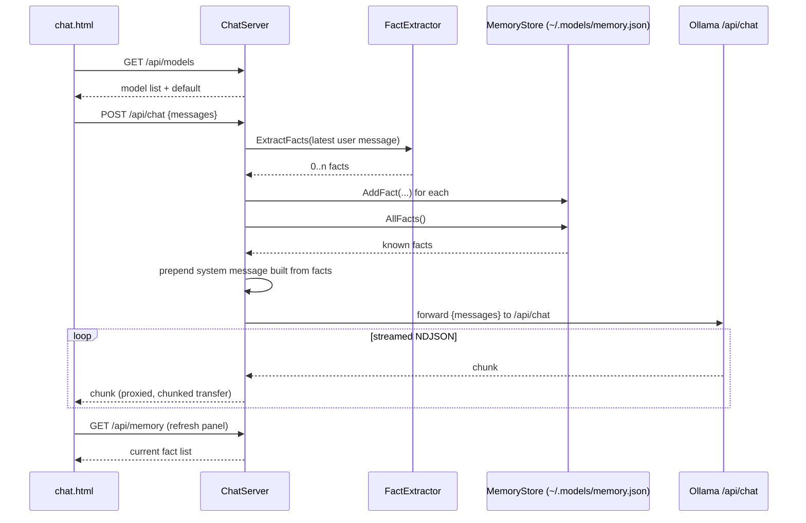

# web/

Two static, dependency-free HTML pages. Neither has a build step --
both are plain HTML/CSS/JS files served as-is.

| File | Served by | Talks to |
|---|---|---|
| `index.html` | opened directly from disk, or any static server | nothing (reads a local `.jsonl` file you pick, or a built-in demo) |
| `chat.html` | `cppcoder --serve` (via `ChatServer`'s `set_mount_point`) | the same process's `/api/*` endpoints, which proxy to Ollama |

## `index.html` -- research task-graph visualizer

Renders a `ResearchEngine` run as an animated graph: each `Task` is a
node, worker/judge outcomes color and label it, and a "Load events…"
button reads a JSON-Lines file straight off disk with `FileReader` --
no server involved at all. A "Run demo" button plays a canned event
sequence (the same PDF-encryption-key scenario used in
`examples/demo_events.jsonl`) so the visualization can be shown without
a real Ollama run.

The event schema it parses is the one `ResearchEngine`'s `EventSink`
writes, one JSON object per line: `question`, `keywords_extracted`,
`task_queued`, `task_started`, `worker_result`, `judge_result`,
`answer_progress`, `answer_found`, `complete`. Produce a real one with:

```
./build/cppcoder --question "..." --codebase . --events-file run.jsonl
```

then open `index.html` and load `run.jsonl` via the file picker. This
is the same file format `examples/replay_demo` replays in the terminal
-- `index.html` is the graphical counterpart, `replay_demo` the
terminal one; both are pure consumers, neither depends on the other.

## `chat.html` -- chat UI

Served by `ChatServer` (see `src/README.md`) at `/`. Talks only to its
own server's `/api/*` routes, never to Ollama directly:

| Route | Used for |
|---|---|
| `GET /api/models` | populate the model dropdown (falls back to a "no models pulled" hint if the list is empty) |
| `POST /api/chat` | send the conversation so far; streamed NDJSON response forwarded straight through from Ollama's own `/api/chat` |
| `GET /api/memory` | populate the 🧠 memory panel |
| `POST /api/memory` | manually add a fact |
| `DELETE /api/memory` | forget a fact |

Conversation history and the last-picked model are kept in
`localStorage` client-side; the fact memory itself lives server-side in
`~/.models/memory.json` (see `include/cppcoder/README.md`'s
`MemoryStore`/`FactExtractor` entries) so it persists across browsers
and survives clearing site data.



The streaming hop in the middle (`Server->>Ollama` / `Ollama-->>Server`)
is the "do all the work inside the first `set_chunked_content_provider`
callback, forward bytes via a nested blocking `httplib::Client::send`"
pattern described in `ChatServer.cpp` -- see `src/README.md` for the
implementation-level note.
